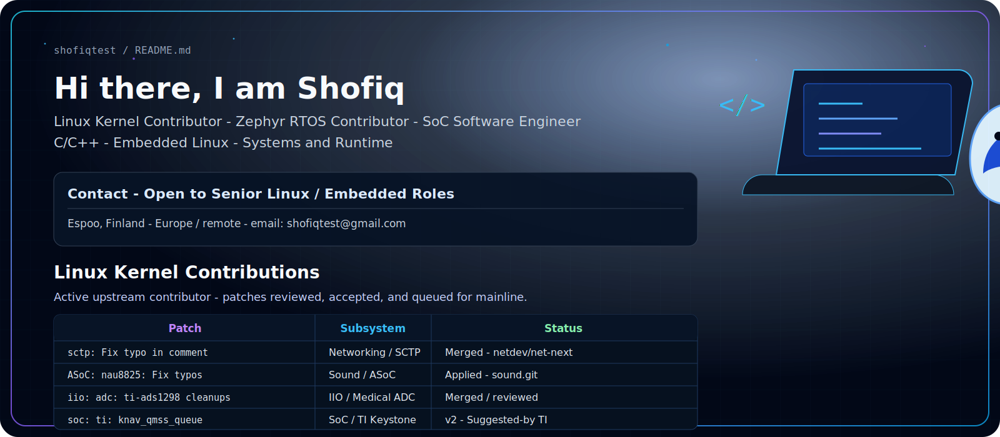

  

## Linux Kernel Contributions

Active upstream contributor across networking, sound, IIO, SoC, SCSI, power supply, and XFS. Public patch history is available on [lore.kernel.org](https://lore.kernel.org/all/?q=Md+Shofiqul+Islam) and [spinics.net](https://www.spinics.net/lists/kernel/).

| Patch | Subsystem | Current status |
| --- | --- | --- |
| [`sctp: Fix typo in comment`](https://git.kernel.org/netdev/net-next/c/c7ea0d2b4d76) | Networking / SCTP | Merged to `netdev/net-next` by Jakub Kicinski |
| `ASoC: nau8825: Fix typos in comments` | Sound / ASoC | Applied to `broonie/sound.git`, queued for Linux 7.2 |
| [`iio: adc: ti-ads1298: Add parentheses around macro parameter`](https://www.spinics.net/lists/kernel/msg6191377.html) | IIO / Medical ADC | v2 under maintainer review |
| [`iio: adc: ti-ads1298: Fix incorrect timeout comment`](https://www.spinics.net/lists/kernel/msg6192178.html) | IIO / Medical ADC | v2 under maintainer review |
| [`iio: adc: ti-ads1298: Remove unnecessary CONFIG2 write during init`](https://www.spinics.net/lists/kernel/msg6192186.html) | IIO / Medical ADC | v2 reviewed positively; waiting on series follow-up |
| [`soc: ti: knav_qmss_queue: Implement resource cleanup in remove()`](https://www.spinics.net/lists/kernel/msg6189942.html) | SoC / TI Keystone | v2 submitted; `Suggested-by: Nishanth Menon` |
| [`scsi: storvsc: Replace symbolic permissions with octal`](https://www.spinics.net/lists/kernel/msg6188547.html) | SCSI / Hyper-V | v2 submitted after review feedback |
| [`scsi: scsi_scan: Fix typo in comment`](https://www.spinics.net/lists/kernel/msg6189223.html) | SCSI core | v2 submitted after review feedback |
| [`power: supply: Fix typos in comments`](https://www.spinics.net/lists/kernel/msg6189221.html) | Power Supply | v2 submitted with `Acked-by: Linus Walleij` |
| [`xfs: Fix typo in comment`](https://www.spinics.net/lists/kernel/msg6190059.html) | XFS Filesystem | v2 submitted with `Reviewed-by: Darrick J. Wong` |

## Zephyr RTOS Contributions

I work on embedded Linux and RTOS driver development, with recent focus on sensor drivers, board bring-up, Devicetree bindings, Kconfig, and upstream-quality C code.

| Contribution | Area | Current status |
| --- | --- | --- |
| [`drivers: sensor: max30101: Add MAX30102 support`](https://github.com/zephyrproject-rtos/zephyr/pull/108697) | Sensor driver, I2C, Devicetree binding, Kconfig, build coverage | Open; changes requested; CI checks green |
| `maxim,max30102` compatible support | Maxim pulse oximeter / heart-rate sensor family | Under review in PR #108697 |
| `tests/drivers/build_all/sensor/i2c.dtsi` coverage | Zephyr sensor build test matrix | Added in response to maintainer review |

## Systems I Like Working On

| Domain | Tools and technologies |
| --- | --- |
| Kernel and BSP | Linux kernel, device drivers, DTS, Kconfig, Makefiles |
| Embedded and RTOS | Zephyr RTOS, C, C++, sensor interfaces, I2C/SPI |
| Runtime and platform | SoC software, debugging, CI, performance-minded systems work |
| Cloud-adjacent engineering | Docker, Kubernetes, Azure AKS, monitoring, automation |

## Tools I Use

  
  
  
  
  
  
  
  
  
  
  
  
  
  
  
  

## Education

- **M.HSc. Biomedical Engineering** - University of Oulu, Finland (2016-2021)
- **M.Sc. Computer Science & Engineering** - Islamic University, Bangladesh (2014-2015)
- **B.Sc. Electrical & Electronics Engineering** - IIUC, Bangladesh (2008-2013)

## Certifications

- Linux for Engineers - The Linux Foundation
- Introduction to RISC-V (LFD110) - The Linux Foundation
- Generative AI and Large Language Models - Coursera

## Featured Projects

| Project | What it shows |
| --- | --- |
| [Real-Time Patient Monitoring on Kubernetes](https://github.com/shofiqtest/real-time-patient-monitoring-k8s) | Cloud-native monitoring architecture |
| Embedded driver work | Low-level C, hardware-facing debugging, upstream workflow |

## GitHub Snapshot

  
  

  

