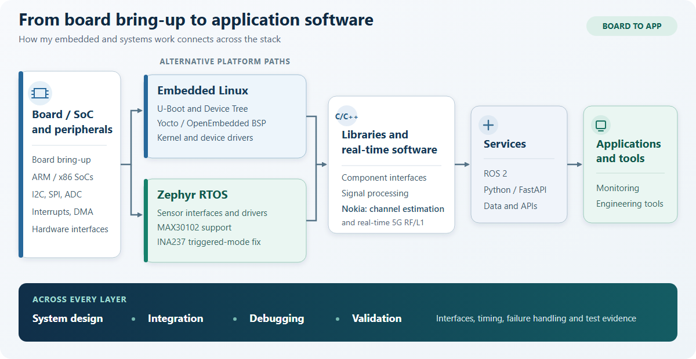

# Md Shofiqul Islam

**Embedded Linux and SoC Software Engineer**

`C/C++` &nbsp;·&nbsp; `Embedded Linux` &nbsp;·&nbsp; `RTOS` &nbsp;·&nbsp; `SoC` &nbsp;·&nbsp; `System Design`

Espoo, Finland &nbsp;·&nbsp; Finnish permanent resident &nbsp;·&nbsp; Open to embedded and systems software roles in Europe

**[Embedded Linux and Software Portfolio](https://kernel-medical.github.io/linux-medical-bsp/)**

**4+ years at Nokia** &nbsp;|&nbsp; **11 mainline Linux commits** 
**2 merged Zephyr changes** &nbsp;|&nbsp; **Merged U-Boot and DPDK fixes**

---

## What I work on

- **Embedded platforms:** I work from board bring-up and kernel/RTOS integration to C/C++ components and application services.
- **Real-time product software:** At Nokia, I worked on 5G RF/L1 and SoC platform software, including channel estimation, hardware integration, target debugging and Python validation tools.
- **Public engineering work:** I contribute to Linux, Zephyr RTOS, U-Boot and DPDK, and build projects in C++ concurrency, ROS 2, Python services and AI-assisted incident investigation.

---

## Tech Stack

- **Core:** C, C++, Python and Bash; Embedded Linux, RTOS and real-time software.
- **Platforms and drivers:** Yocto/OpenEmbedded, U-Boot, Device Tree, Linux IIO, Zephyr RTOS and ARM64 SoCs.
- **Integration and debugging:** Hardware/software interfaces, GDB, JTAG, logs, traces, perf and ftrace.
- **Networking and applications:** DPDK, NXP DPAA2, SONiC tooling, ROS 2, FastAPI and Docker.
- **Build and validation:** Git, CMake, BitBake, Jenkins, GitHub Actions, Robot Framework and automated regression testing.
- **Additional work:** RISC-V coursework and quantum-software contributions through Qiskit and D-Wave Ocean.

---

## From Board Bring-Up to Application Software

My work covers the full path from board bring-up to application software. At the platform layer, I work with U-Boot, Device Tree, Yocto/OpenEmbedded, Linux kernel drivers and Zephyr RTOS sensor interfaces. Above that, I develop C/C++ libraries, real-time software, system services and the interfaces between components.

System design connects these layers: how data moves, where timing matters, how failures are handled and how the result is tested. My Nokia work provides the production foundation; my open-source and personal projects extend it into sensor drivers, ROS 2 integration, Python/FastAPI services and engineering tools.

<picture>
  <source media="(max-width: 700px)" srcset="assets/software-layers-mobile.png">
  
</picture>

---

## Selected Projects

- **[Linux Medical BSP](https://kernel-medical.github.io/linux-medical-bsp/):** Embedded Linux portfolio connecting BSP, driver, sensor-integration and lifecycle-documentation work.
- **[ROS 2 IIO Medical](https://github.com/kernel-medical/ros2_iio_medical):** C++ ROS 2 nodes for Linux IIO polling and triggered-buffer acquisition, with a synthetic sensor simulator and parser tests.
- **[Evidence-First Incident Agent](https://github.com/shofiqtest/evidence-first-incident-agent):** Python/FastAPI incident investigation over synthetic telemetry, with evidence-linked reports and a CI-backed automated test suite.
- **[High-Performance Event Engine](https://github.com/shofiqtest/high-performance-event-engine):** C++ concurrency and performance project with a bounded atomic queue and throughput/latency reporting.

---

## Linux Kernel Contributions

- **Sensor and ADC work:** Three merged TI ADS1298 fixes; MAX86150 ECG/PPG and ADS1299 biopotential ADC drivers under review.
- **Platform and data-path fixes:** Merged resource cleanup for TI Keystone SoC and a permissions fix for Hyper-V storage.
- **Additional mainline work:** ASoC, SCSI, XFS, SCTP, MFD and power-supply maintenance fixes.

[Mainline commits](https://github.com/torvalds/linux/commits/master/?author=shofiqtest) · [Patch archive](https://github.com/shofiqtest/linux-kernel-patches) · [Mailing-list history](https://lore.kernel.org/all/?q=Md+Shofiqul+Islam)

---

## Zephyr RTOS Contributions

- **[MAX30102 support](https://github.com/zephyrproject-rtos/zephyr/pull/108697):** Added MAX30102 support to the existing MAX30101-family optical sensor driver. Merged.
- **[INA237 sampling fix](https://github.com/zephyrproject-rtos/zephyr/pull/110094):** Made triggered-mode `sample_fetch` wait for conversion readiness before returning data. Merged.

---

## U-Boot Contributions

- **[`board/ge/common/vpd_reader.c`](https://github.com/u-boot/u-boot/commit/d2d005a32b97):** Corrected the `errloc` allocation in `verify_bch()` to use `ecc_bits` rather than the much larger `data_length`. Merged.

---

## Quantum Computing Contributions

- **[Qiskit PR #16590](https://github.com/Qiskit/qiskit/pull/16590):** Proposed a memory-safety fix for writes to uninitialized buffers in the transpile-layout C API. Open.
- **[D-Wave Ocean SDK PR #453](https://github.com/dwavesystems/dwave-ocean-sdk/pull/453):** Added Advantage2 to the SDK overview documentation. Merged.

---

## DPDK / Networking Contributions

My DPDK work covers NXP DPAA2 bus and DMA code, including device-removal and error-handling fixes. This is part of my open-source work on the platform software behind high-performance networking.

- **[DPAA2 DMA removal](https://github.com/DPDK/dpdk/commit/611ef29e2c768bcede197996ddd9c5a37cf1a243):** Propagates device-removal failures so callers can handle them.
- **[FSLMC bus unplug](https://github.com/DPDK/dpdk/commit/180b4c70c422580d1dd4b8094366c2186b3a04a9):** Clears driver references only after successful removal.
- **[DPDK 26.07 contributor listing](https://mails.dpdk.org/archives/announce/2026-July/000565.html):** Listed among the release's new contributors.
- **SONiC PFC Watchdog:** [Handled incomplete `PFC_WD` database entries](https://github.com/shofiqtest/sonic-utilities/commit/705b59313b42b18c0dbd047536d08819015034df) and [fixed the related regression assertion](https://github.com/shofiqtest/sonic-utilities/commit/8371bbe45e03e9fbb3fa22cdf74a4e29d17be84a).

<strong>View how DPDK supports data-center packet processing</strong>

 

Technical background: [DPDK poll-mode drivers](https://doc.dpdk.org/guides/prog_guide/ethdev/ethdev.html) and [data center use cases](https://www.dpdk.org/ecosystem/use-cases/). [Download the diagram](assets/dpdk-data-center.png).

---

## Certifications

- Introduction to RISC-V (LFD110): The Linux Foundation
- Linux for Engineers: The Linux Foundation
- Generative AI and LLMs: Coursera

---

## Full Project Directory

I keep my public projects under [shofiqtest](https://github.com/shofiqtest?tab=repositories) and [kernel-medical](https://github.com/kernel-medical). Every project remains listed here without making the main profile harder to scan.

<strong>View all projects and repositories</strong>

 

### Software and engineering projects

| Project | Focus | What is in the repository |
|---|---|---|
| [Evidence-First Incident Agent](https://github.com/shofiqtest/evidence-first-incident-agent) | Python, FastAPI, AI/AIOps | Incident investigation over synthetic telemetry, optional LLM integration, evidence-cited reports, automated evaluation and Docker CI. |
| [High-Performance Event Engine](https://github.com/shofiqtest/high-performance-event-engine) | C++, concurrency, performance | Sensor-event simulation and benchmark with multiple producers and consumers, a bounded atomic queue, and throughput/latency reporting. |
| [Patient Monitoring Prototype](https://github.com/shofiqtest/real-time-patient-monitoring-k8s) | Python, FastAPI, containers | Patient-record APIs, PostgreSQL/Redis integration, and Docker, Kubernetes, Helm and Terraform configurations. |
| [Linux Kernel Patch Archive](https://github.com/shofiqtest/linux-kernel-patches) | C, Linux kernel | Patch files covering driver cleanup, resource handling and a proposed MAX86150 IIO biosensor driver; upstream contribution evidence is linked in the contribution sections. |
| [Route Simulator Concept](https://github.com/shofiqtest/--Route-Simulator) | Geographical simulation concept | README outlining constant-speed movement along a repeating route defined by geographical points. |

### Kernel Medical projects

| Project | Focus | What is in the repository |
|---|---|---|
| [kernel-soup-gen](https://github.com/kernel-medical/kernel-soup-gen) | Python, source analysis | Generates Markdown SOUP record drafts from Linux driver metadata, Kconfig dependencies, maintainer information and Git history. |
| [ros2_iio_medical](https://github.com/kernel-medical/ros2_iio_medical) | C++, ROS 2, Linux IIO | ROS 2 nodes for sysfs polling and triggered-buffer acquisition, with configurable topics, a synthetic sensor simulator and channel-parser tests. |
| [iec62304-embedded-drivers](https://github.com/kernel-medical/iec62304-embedded-drivers) | Software lifecycle documentation | Reference requirements, design, SOUP, FMEA and lifecycle documents for embedded biosensor drivers and ROS 2 integration. |
| [linux-medical-bsp](https://github.com/kernel-medical/linux-medical-bsp) | Embedded Linux portfolio | Landing page describing medical Linux BSP services, related projects and driver case studies. [View the portfolio](https://kernel-medical.github.io/linux-medical-bsp/). |
| [kernel-medical.github.io](https://github.com/kernel-medical/kernel-medical.github.io) | Interactive engineering portfolio | Project and contribution links, with synthetic biosignal visualizations and system architecture. [Visit the site](https://kernel-medical.github.io). |

### Profile and earlier portfolio work

| Repository | Purpose |
|---|---|
| [GitHub Profile](https://github.com/shofiqtest/shofiqtest) | This profile README and project directory. |
| [Earlier Linux Medical BSP Page](https://github.com/shofiqtest/linux-medical-bsp) | Earlier static landing page for the Linux medical software initiative; current projects are maintained under kernel-medical. |

<strong>Upstream forks and learning repositories</strong>

These are my forks of upstream projects. Links to my patches and reviews are in the contribution sections above.

| Fork | Upstream project | Area |
|---|---|---|
| [linux](https://github.com/shofiqtest/linux) | [Linux](https://github.com/torvalds/linux) | Kernel source and driver development. |
| [zephyr](https://github.com/shofiqtest/zephyr) | [Zephyr RTOS](https://github.com/zephyrproject-rtos/zephyr) | Embedded RTOS and sensor drivers. |
| [u-boot](https://github.com/shofiqtest/u-boot) | [U-Boot](https://github.com/u-boot/u-boot) | Bootloader and platform software. |
| [qiskit](https://github.com/shofiqtest/qiskit) | [Qiskit](https://github.com/Qiskit/qiskit) | Quantum computing SDK. |
| [sonic-utilities](https://github.com/shofiqtest/sonic-utilities) | [SONiC Utilities](https://github.com/sonic-net/sonic-utilities) | Network operating-system command-line tools. |
| [SlicerIGT](https://github.com/shofiqtest/SlicerIGT) | [SlicerIGT](https://github.com/SlicerIGT/SlicerIGT) | Image-guided intervention modules for 3D Slicer. |
| [Medical-Shop-Management](https://github.com/shofiqtest/Medical-Shop-Management) | [Medical-Shop-Management](https://github.com/sanghis96/Medical-Shop-Management) | C++ medical-shop management example. |

---

For embedded software roles or questions about my projects, you can reach me at: 
<a href="mailto:shofiqtest@gmail.com">shofiqtest@gmail.com</a>

